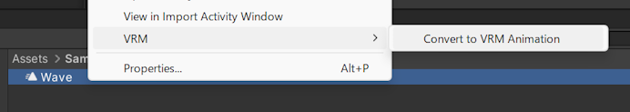
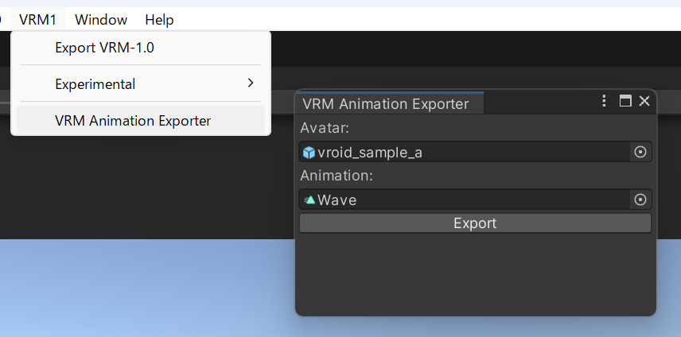
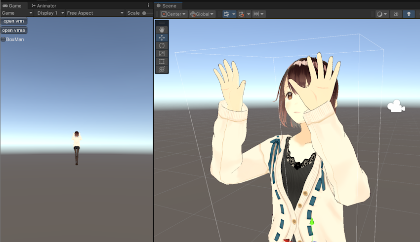

# AnimationClipToVrmaSample

ヒューマノイドのモーションからなるAnimation Clipを VRM Animation (.vrma) に変換するプロジェクトです。

※この方法で変換した`.vrma`ファイルには何かしらの形でモデルの骨格情報が埋め込まれます。このことに関連して、とくに`.vrma`ファイルの再配布を検討している場合、このREADMEを必ず最後まで読んで下さい。

Sample Project to convert AnimationClip asset to VRM Animation (.vrma) in Unity.

*The document below is in Japanese, except `Notice about License` section. If you want to redistribute `.vrma` file, you also MUST understand what is written in `Notice about VRMA file redistribution` section in addition to the license section.

# Install

- Projectを丸ごと使う場合:
    - このレポジトリ自体をcloneし、プロジェクトとして開く
- 既存のプロジェクトに変換用の処理を導入する場合: 
    - 使用中のプロジェクトに[UniVRM 0.115.0](https://github.com/vrm-c/UniVRM/releases/tag/v0.115.0)を導入
    - Releasesページのunitypackageをダウンロードしてプロジェクトに追加

# Usage

## 必要なもの

- Humanoid向けにセットアップされたAnimationClip
- (変換方法2でのみ必要) AnimationClipの再生に用いる人型アバター

以下のことにも留意してください。

- AnimationClipは単独のファイル、またはFBXファイル等の一部として含まれるデータのいずれかの形で準備します。
- AnimationClipの再生に用いる人型アバターがVRMの場合のみ動作確認していますが、VRM以外のモデルでも動作する想定です。
- プロジェクトをcloneした場合、AnimationClipとアバター双方のサンプルを同梱しています。
    - 同梱しているアバターはVRoidのモデルであるため、後述のライセンスも参照下さい。

## 変換方法1: AnimationClipの右クリックから変換

プロジェクトビュー上でAnimationClipアセットを右クリックして`VRM/Convert to VRM Animation`を実行することで、モーションを変換した`.vrma`ファイルを出力します。

この方法ではVRoidのサンプルモデル骨格をリファレンスとした`.vrma`が出力されます。
この出力で得られた`.vrma`の見た目がとくに問題ない場合、簡単な手順です。

## 変換方法2: VRM Animation Exporterウィンドウから変換

メニューバーから`VRM/VRM Animation Exporter`を選択して`VRM Animation Exporter`ウィンドウを表示します。
表示後、次のように指定します。

- `Avatar`: Tポーズになっているアバターのprefabで、`Animator`コンポーネントを含むもの
- `Animation`: 変換したいAnimationClip

その後、`Export`ボタンを選択することで `.vrma` ファイルを出力します。

この手順ではVRM Animationにおいてリファレンスとなるアバターの骨格を指定できます。
`.vrma` の生成と適用に共通のアバターを指定してモーションの再現度を高めたい場合、この手順を使用します。

# 変換後のVRM Animationの動作を確認する方法

※[VRoid Hub](https://hub.vroid.com/)の撮影ブース機能など、ウェブ上で `.vrma` ファイルが再生出来る方法も併用できます。この節では、Unity Editorのみで確認する方法の例を紹介しています。

VRM Animationの適用対象にするアバターのVRMを用意し、UniVRM 0.115.0のサンプルパッケージを導入します。

- リリース: https://github.com/vrm-c/UniVRM/releases/tag/v0.115.0
- unitypackage: https://github.com/vrm-c/UniVRM/releases/download/v0.115.0/VRM_Samples-0.115.0_7e05.unitypackage

*本レポジトリでは上記パッケージに含まれる`VRM10_Samples`フォルダをgitignoreの対象としています。

パッケージの導入後、`VRM10_Samples/SimpleVrma/SimpleVrma`シーンを開いて実行し、アバターと`.vrma`ファイルを読み込んで動作を確認します。

この手順では`.vrma`ファイルに埋め込まれたアバター骨格に基づくモデルも表示されますが、これは`BoxMan`チェックをオフにすることで非表示になります。

# Notice about VRMA file redistribution

`.vrma` ファイル内には、アニメーションの再生を実行したモデルのHumanoidボーンの骨格情報が埋め込まれます。

このことに基づき、とくにVRM Animationファイルの再配布時は次のことに留意してください。

- `VRM Animation Exporter`ウィンドウに指定するアバターモデルについて、モデルの再配布が許可され、かつクレジット表記が不要であるようなモデルを用いることを検討して下さい。
- `.vrma`ファイルの出力時にどのモデルを使用したかについて記録を取っておくことを検討して下さい。

ただし、この注記は本レポジトリ自体のライセンスではありません。

# Notice about License

- `Assets/Model_VRoidSampleA` フォルダ内のファイルはVRMファイル自体のライセンスに従います。
    - VRMの取得元: [AvatarSample_A](https://hub.vroid.com/characters/2843975675147313744/models/5644550979324015604)
- `Assets/AnimationClipToVrma/Scripts/Editor/AssetCommands` フォルダ内のコードは上記モデルの骨格情報に相当する値をハードコードしているため、この値をそのまま使う場合も上記モデルのライセンスに沿ってご使用下さい。
    - この注意書きは`変換方法1: AnimationClipの右クリックから変換`の方法を使う場合に関するものです。
    - `VRM Animation Exporter`ウィンドウを使って`.vrma`を生成する場合、この数値は使用されません。
- 上記を除くリソースのライセンスは`LICENSE`ファイルに従います。

- Model data in `Assets/Model_VRoidSampleA` has own license based on VRM data format.
    - Model Source: [AvatarSample_A](https://hub.vroid.com/characters/2843975675147313744/models/5644550979324015604)
- The scripts in `Assets/AnimationClipToVrma/Scripts/Editor/AssetCommands` contain the hard-coded bone poses data of the model above.
    - This note is about when you create `.vrma` file by the way in `変換方法1: AnimationClipの右クリックから変換` section.
    - When you use `VRM Animation Exporter` window, the convert process does not use those scripts.
- Other resources in the repository is licensed according to `LICENSE` file.

# For Developer: Update Model_Value.cs content based on another model

`変換方法1: AnimationClipの右クリックから変換`で参照している骨格情報を他のアバターのものに書き換えるには次のようにします。

- このプロジェクトをcloneします。
- 書き換えに使いたいアバターのprefabをプロジェクトビュー上で右クリックし、`VRM/Util/Export Bone Pose Script`を実行します。
    - この操作によって、デスクトップフォルダに`ReferenceHumanoid.cs`ファイルが保存されます。
- 生成されたファイルの内容を全てコピーし、このプロジェクト上にある `ReferenceHumanoid.cs` にペーストして内容を差し替えます。

